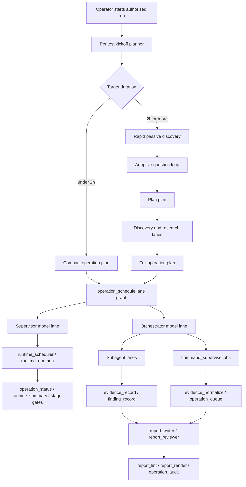

This is the users orginal prompt, honor this first:
--

This one's going to be a massive pass. Okay, the idea is that Elm code, the biggest problem with it is I set it on a raffle loop last night for 20 hours to be able to develop Elm code. I am thoroughly unimpressed after a lot of API usage. Whatever, it's fine. My biggest issue, however, is simple. The model isn't really able to work for 20 hours. It does not have what it needs. First off, let's talk about plugins, PRs, and extensions. The first thing I want you to do is do a huge amount of research online. Look into stuff like Oh My OpenCode. Look at PRs for OpenCode that the community likes but were never merged. Basically, from what I understand, the OpenCode devs are working on making the harness stable and work well, but they're not focused on building out features. Oh My OpenCode will be the base. You're going to take that plugin and install it as one of the main things. There's a million other things, harnesses and stuff like that. You're going to have orchestrator models. You're going to have a supervisor model as well. The supervisor model will manage the task over that 20 or so hours. There's a ton of different things. The end goal is to be able to just leave it overnight for an entire day, sitting on a laptop in a school district. The original version of UlmCode before all these commits, the old version, had a lot of features. One of them, for example, that was extraordinarily useful was The model being able to see what packages existed on the user's device, specifically for cybersecurity-related tasks. The model should also be able to download stuff broadly. This is not going to be open source. I don't know, some people might want this, some people won't. We will want this. It's built for a very small amount of people.

Additionally, now I am focused very hard on giving it what I need. I think a core thing is a plan, a plan that will — my vision, the way I envision this, is Oh My OpenCode is the base. Its ability to delegate sub-agents successfully, the emphasis on parallelizing everything, which is incredibly important. You know, one of the big issues is some commands take over 20 hours on their own. So even if you have two 10-hour commands, some ping sweeps cannot be sped up that much. You need ways to be able to handle that without the model just sitting there and waiting for that command forever. And, you know, if it actually — you should make it clear: you should never run a command that it's waiting for that should take more than two minutes at most. And it should be able to get pinged if it, you know, if it goes past two minutes. The command shouldn't necessarily end, but maybe you should bump it and allow it to continue working while that terminal runs in the background.

I think one of the core things that was lost on this was the penetration test mode kicking off into a plan mode at first. The idea is the model should use dozens of subagents to get an idea of the network, a very basic passive scan. That should be very quick. It should then ask a series of questions. From there, it will create, as stupid as it sounds, the plan plan, which is a plan to make a plan. It will then kick off research due to discovery and get a strong idea of the network. It will collect all its findings, and then it will go ahead and use a version of the report finder, specifically the plan mode, that will go ahead and create the full plan. And the user will specify the amount of time, the amount of time that it should be working. If the user says 36 hours, "I'm leaving you for that long," the plan should be able to cover 36 hours. If the user says less than two hours, then it should skip that and just go straight to a normal plan. The thing is, you know, that massive long plan should be there.

From there, it gets handed off to a supervisor model. I want you to look at what Codex is doing recently on their public open source CLI. They have added slash goal mode. Slash goal mode works incredibly well, but it can be improved. We're going to be taking the ideas of that. The idea is simple: you're going to use a supervisor model. That model will go ahead and it will be watching over the main orchestrator agent that kicks off all of the very many, you know, sub-agents. That orchestrator agent, you know, its job is the same as the current penetration test one, but it should be multiplied excessively. Parallelize as much as humanly possible, doing aggressive parallelization. Plan mode itself should be completely redesigned. This is another great example of where you can do research, where you can take community plugins, or where you could take even private code, you know. For now, any private code, as long as you put the attribution and the license to it, we will sort out all the legal stuff down the line. It's just important to get as much progress as possible.

This is incredibly important to make sure that you do ample amounts of research. There is a plugin called planoutator. It goes ahead and it, you know, makes, allows the model to make more rich, modern plans. You know, depending on the length of the first couple things it should ask, once the model has a good idea of the overall task length, then we'll go ahead and ask more and more questions. As it discovers stuff, it will continuously ask more until it creates its plan.


# ULM Overnight Supervisor Implementation Plan

> **For agentic workers:** REQUIRED SUB-SKILL: Use superpowers:subagent-driven-development (recommended) or superpowers:executing-plans to implement this plan task-by-task. Steps use checkbox (`- [ ]`) syntax for tracking.

**Goal:** Build the missing long-run ULMCode autonomy layer so an authorized operator can leave ULMCode running for 20-36 hours on a laptop during a K-12 security engagement without the main model stalling, forgetting the mission, or pretending a chat loop is an execution engine.

**Architecture:** Keep OpenCode's current stable harness as the base, keep Oh My OpenAgent as the profile-level orchestration layer, then add a durable ULM supervisor plane above the existing operation graph, scheduler, command supervision, and report artifacts. The supervisor owns objective persistence, duration-aware planning, lane health, foreground-command discipline, tool inventory, and evidence-based completion, while the orchestrator and subagents perform bounded work units.

**Tech Stack:** Bun, TypeScript, OpenCode core/session/tool APIs, existing ULM operation artifacts under `.ulmcode/operations/<operation-id>/`, Oh My OpenAgent 3.17.12 vendored profile plugin, Plannotator profile integration, CLI/TUI/server surfaces already present in `packages/opencode`.

---

## Compaction Resume Protocol

This section is intentionally first. If context compacts, read this file before touching code.

- [ ] Confirm you are in the isolated worktree:

```bash
git -C /Users/trevorrosato/.config/superpowers/worktrees/opencode/ulm-overnight-supervisor status --short --branch
```

Expected: branch starts with `## codex/ulm-overnight-supervisor`.

- [ ] Read the durable repo rules:

```bash
sed -n '1,220p' /Users/trevorrosato/.config/superpowers/worktrees/opencode/ulm-overnight-supervisor/AGENTS.md
```

Expected: confirms default branch `dev`, tests from `packages/opencode`, ULM operation tool contracts, and profile validation commands.

- [ ] Read the latest implementation status in this plan:

```bash
rg -n "^\- \[[ x]\]" /Users/trevorrosato/.config/superpowers/worktrees/opencode/ulm-overnight-supervisor/docs/superpowers/plans/2026-05-06-ulm-overnight-supervisor.md
```

Expected: shows task checkboxes. Continue from the first unchecked task whose prerequisites are checked.

- [ ] Before claiming completion, run the verification ladder in `Final Verification Ladder`.

Do not restart from scratch after compaction. The worktree, branch, tests, and this plan are the durable state.

## Current Worktree State

- Worktree: `/Users/trevorrosato/.config/superpowers/worktrees/opencode/ulm-overnight-supervisor`
- Branch: `codex/ulm-overnight-supervisor`
- Base at creation: `dev` / `690184c81 Accept tool-owned literal autonomy proof`
- Dependency install: `bun install --frozen-lockfile` completed successfully in this worktree.
- Baseline ULM checks already run and passed:

```bash
bun run --cwd packages/opencode test:ulm-tool-manifest
bun run --cwd packages/opencode test:ulm-rebuild-audit
```

Expected already observed:

```text
ulm_tool_manifest: ok (6 tools, 4 profiles)
ulm_rebuild_audit: ok
```

## Product Thesis

OpenCode is optimizing for a stable agent harness. ULMCode needs a biased, opinionated long-run operator layer for a small internal group. That means ULMCode should not wait for upstream to bless every feature. It should borrow the stable pieces from upstream, vendor profile-level plugin ideas where licensing allows, and build the missing supervision semantics locally.

The old failure mode was putting a model in a loop and hoping it stayed useful. The new target is different:

- The model is allowed to think.
- The runtime owns long waits.
- Background lanes own slow commands.
- Durable artifacts own memory.
- Supervisor reviews own continuity.
- Evidence and gates own "done."

The hard rule: the primary model must not block on a foreground command expected to run longer than two minutes. Long jobs move into `command_supervise`, `task(background=true)`, `operation_schedule`, `operation_run`, or `runtime_daemon`.

## Research Ledger

### Codex Goal Mode

Tracked public OpenAI Codex work:

- [openai/codex#18073](https://github.com/openai/codex/pull/18073): goal persistence foundation.
- [openai/codex#18074](https://github.com/openai/codex/pull/18074): app-server API.
- [openai/codex#18075](https://github.com/openai/codex/pull/18075): model tools.
- [openai/codex#18076](https://github.com/openai/codex/pull/18076): core runtime.
- [openai/codex#18077](https://github.com/openai/codex/pull/18077): TUI UX.
- [openai/codex#20082](https://github.com/openai/codex/pull/20082): `/goal resume`.

Lessons to port, with improvements:

- Persist objective state outside chat.
- Give models constrained goal tools, not random mutable scratchpads.
- Only let the model mark a goal complete after evidence review.
- Use budget/continuation steering, but do not let continuation become an infinite honor-system loop.
- Start continuation only when the session is idle and no user input is pending.
- Suppress repeat continuation if a continuation turn performs no tool calls.
- Add ULM-specific supervisor authority: the supervisor can inspect operation artifacts, stale lanes, runtime summaries, and plan gaps, then enqueue specific next actions.

### Oh My OpenAgent / Oh My OpenCode

Local profile already vendors `oh-my-openagent@3.17.12` at:

```text
tools/ulmcode-profile/plugins/vendor/oh-my-openagent-3.17.12/
```

Current profile config already uses:

```text
tools/ulmcode-profile/oh-my-openagent.jsonc
```

Relevant existing OMO ideas:

- `Sisyphus`: main orchestrator.
- `Prometheus`: plan builder.
- `Atlas`: plan executor.
- `Ralph Loop`: iteration loop with `.sisyphus/ralph-loop.local.md`.
- Ultrawork verification lane through Oracle-style verification.
- Background-aware continuation checks.
- Todo continuation enforcement with stagnation and failure caps.

ULM stance:

- Keep OMO as the base profile orchestration layer.
- Do not trust Ralph/Ultrawork completion tags as sufficient completion proof.
- Require ULM operation artifacts, stage gates, runtime summaries, evidence records, report lint, and operation audit for completion.
- Keep OMO's parallelization instincts, but wire them into ULM lane graphs so progress survives compaction and process restarts.

OMO issues and PRs that shape this plan:

- [code-yeongyu/oh-my-openagent#2627](https://github.com/code-yeongyu/oh-my-openagent/issues/2627): parent stuck waiting for background agents. ULM must not rely only on transient notification delivery.
- [code-yeongyu/oh-my-openagent#2462](https://github.com/code-yeongyu/oh-my-openagent/issues/2462): todo continuation loops on token limits. ULM must classify budget/context blockers and stop cleanly.
- [code-yeongyu/oh-my-openagent#2591](https://github.com/code-yeongyu/oh-my-openagent/issues/2591): token-limit detection in continuation.
- [code-yeongyu/oh-my-openagent#1775](https://github.com/code-yeongyu/oh-my-openagent/issues/1775): no-progress loops should pause continuation.
- [code-yeongyu/oh-my-openagent#1921](https://github.com/code-yeongyu/oh-my-openagent/issues/1921): promise-based completion can be bypassed.
- [code-yeongyu/oh-my-openagent#1923](https://github.com/code-yeongyu/oh-my-openagent/issues/1923): completion should require minimum tool-call verification.
- [code-yeongyu/oh-my-openagent#953](https://github.com/code-yeongyu/oh-my-openagent/issues/953): main agent can summarize before subagents finish.

### OpenCode Community PRs To Mine

High-signal open or unmerged OpenCode community work:

- [anomalyco/opencode#12633](https://github.com/anomalyco/opencode/pull/12633): auto-accept mode for edit permission requests. ULM can adopt only as a scoped unattended-policy mode, never broad unsafe auto-approval.
- [anomalyco/opencode#12520](https://github.com/anomalyco/opencode/pull/12520): MCP lazy loading and `mcp_search`. Strong candidate for context/tool-bloat reduction.
- [anomalyco/opencode#14741](https://github.com/anomalyco/opencode/pull/14741): plugin stream hooks for `stream.delta` and `stream.aborted`. Candidate for watchdog/supervisor correction hooks.
- [anomalyco/opencode#14743](https://github.com/anomalyco/opencode/pull/14743): Anthropic cache-hit stability through stable/dynamic system-block split. Useful for long-run cost and latency control.
- [anomalyco/opencode#20467](https://github.com/anomalyco/opencode/pull/20467): AI SDK v6 finish reason `other`. Current ULM branch likely needs this bug fix so MCP/tool calls do not yield blank assistant turns.
- [anomalyco/opencode#20711](https://github.com/anomalyco/opencode/pull/20711): sidekick parallel chat companion. Useful inspiration for supervisor sidecar snapshots, but not a direct port.
- [anomalyco/opencode#1848](https://github.com/anomalyco/opencode/pull/1848): plugin install/uninstall command. Useful later for private plugin management.
- [anomalyco/opencode#5958](https://github.com/anomalyco/opencode/pull/5958): ask-question tool. Current ULM already has a native `question` tool, so use the idea, not the code.

### Old ULM Feature Archaeology

The old fork had a useful local cybersecurity package/tool inventory. Source branch located during research:

```text
codex/tool-inventory-20260213
```

Relevant old files:

```text
packages/opencode/src/session/tooling.ts
packages/opencode/src/session/system.ts
```

Old behavior:

- Detect local tools with `Bun.which`.
- Probe versions with short timeouts.
- Cache inventory for five minutes.
- Default on unless `ULMCODE_TOOLING_INVENTORY=0`.
- Render compact prompt context with installed/missing tools and SecLists status.

Tools covered included:

```text
amass, subfinder, assetfinder, gau, waybackurls, katana, dnsx, naabu, httpx,
nuclei, ffuf, gobuster, feroxbuster, nikto, sqlmap, nmap, masscan, rustscan,
nc, netcat, tcpdump, tshark, sslscan, testssl.sh, whois, hydra, john, hashcat,
nxc, enum4linux-ng, smbmap, impacket-smbclient, wafw00f, dnsrecon, dirsearch,
mitmproxy, bettercap, searchsploit, binwalk, r2, yara, yr, trivy, semgrep,
gitleaks, wpscan, whatweb
```

New stance:

- Restore the capability, but not as prompt-only magic.
- Make it a durable ULM inventory artifact and a runtime tool the supervisor can query.
- Feed inventory into `tool_acquire`, `command_supervise`, plan generation, and operator setup guidance.

## Existing ULM Surfaces To Build On

These already exist and should be used rather than reimplemented:

- `.ulmcode/operations/<operation-id>/` artifact root.
- `operation_plan`
- `operation_schedule`
- `operation_run`
- `operation_next`
- `operation_checkpoint`
- `operation_status`
- `operation_resume`
- `operation_recover`
- `operation_stage_gate`
- `operation_audit`
- `runtime_scheduler`
- `runtime_daemon`
- `runtime_summary`
- `command_supervise`
- `tool_acquire`
- `operation_queue`
- `operation_queue_next`
- `evidence_record`
- `evidence_normalize`
- `finding_record`
- `report_outline`
- `report_lint`
- `report_render`
- `task(background=true)`
- `task_status`
- `task_list`
- Native agents: `pentest`, `recon`, `attack-map`, `validator`, `evidence`, `report-writer`, `report-reviewer`
- Profile plugin: `tools/ulmcode-profile/plugins/ulmcode-runtime-guard.js`
- Profile OMO config: `tools/ulmcode-profile/oh-my-openagent.jsonc`
- Tool catalog: `tools/ulmcode-profile/tool-manifest.json`

## Design Decisions

- [x] Work happens in a separate worktree.
- [x] OpenCode upstream harness remains the base.
- [x] Oh My OpenAgent remains the profile-level orchestration base.
- [x] ULM completion is evidence-based, not promise-tag-based.
- [x] The supervisor model is a first-class role, not another normal recon subagent.
- [x] Plan mode is redesigned around duration and discovery.
- [x] Pentest mode starts with planning before broad execution.
- [x] Commands expected to exceed two minutes are background/supervised work, not foreground shell calls.
- [x] Old local tool inventory gets restored as a durable artifact/tool.
- [x] Plannotator is opt-in for richer plan critique and question refinement.
- [x] Community PRs are mined selectively; no giant unreviewed patch dump.

## Target User Flow

### Fast Run Under Two Hours

1. Operator starts a pentest run and gives scope/time.
2. ULM enters plan mode.
3. ULM asks only the minimum missing questions.
4. ULM writes a compact operation plan.
5. ULM schedules a small lane graph.
6. Orchestrator runs bounded subagents and supervised commands.
7. Supervisor checks status and final report gates.

Note: The creation of Action Mode (rename build mode) will be added. Similar to action mode in the prerewrite as seen in this repo, action mode is targeted on short term operations. Pentest mode is always long autonomus runs that have a plan. The difference is that compact operation mode doesn't have layers of plans that will take up like 30% of the time budget just to make.

### Overnight Run, 20-36 Hours

1. Operator starts a pentest run and says they are leaving it for 20-36 hours.
2. ULM enters plan mode automatically.
3. ULM performs a very fast passive/basic discovery pass through parallel subagents and short supervised commands.
4. ULM asks initial scope, authorization, time, network, reporting, and safety questions.
5. ULM writes a "plan plan": what must be discovered before the full plan is trustworthy.
6. ULM kicks off discovery/research lanes.
7. ULM continuously updates questions as discovery changes what matters.
8. ULM writes the full duration-aware operation plan.
9. Supervisor model takes over health/governance.
10. Orchestrator launches lane graph work aggressively in parallel.
11. Runtime daemon/scheduler owns long waits.
12. Supervisor periodically audits stalled lanes, stale jobs, evidence gaps, budget/context pressure, report progress, and next actions.
13. Final closeout invokes report writer, report reviewer, report lint, report render, runtime summary, stage gates, and operation audit.

## Architecture Map



## Files And Responsibilities

Likely files to create:

- `packages/opencode/src/ulm/operation-goal.ts`
  - Persistent operation objective, user time budget, completion policy, and continuation state.
- `packages/opencode/src/ulm/operation-supervisor.ts`
  - Supervisor review logic over operation status, runtime summaries, lane graph, evidence, report gates, and stale jobs.
- `packages/opencode/src/ulm/pentest-kickoff.ts`
  - Duration-aware plan-first pentest kickoff policy and question selection.
- `packages/opencode/src/ulm/tool-inventory.ts`
  - Local cybersecurity package/tool inventory with version probes and durable artifact writing.
- `packages/opencode/src/tool/operation_goal.ts`
  - Tool wrapper for creating/reading/completing operation goals.
- `packages/opencode/src/tool/operation_goal.txt`
  - Model-facing instructions for operation goal usage.
- `packages/opencode/src/tool/operation_supervise.ts`
  - Tool wrapper that runs supervisor review and writes supervisor artifacts.
- `packages/opencode/src/tool/operation_supervise.txt`
  - Model-facing supervisor instructions.
- `packages/opencode/src/tool/tool_inventory.ts`
  - Tool wrapper for local cybersecurity inventory.
- `packages/opencode/src/tool/tool_inventory.txt`
  - Model-facing inventory instructions.
- `packages/opencode/test/ulm/operation-goal.test.ts`
  - Unit tests for objective persistence and completion constraints.
- `packages/opencode/test/ulm/operation-supervisor.test.ts`
  - Unit tests for supervisor decisions.
- `packages/opencode/test/ulm/pentest-kickoff.test.ts`
  - Unit tests for duration-aware planning flow.
- `packages/opencode/test/ulm/tool-inventory.test.ts`
  - Unit tests for local tool detection/probing.
- `packages/opencode/test/tool/operation_goal.test.ts`
  - Tool parameter/result contract tests.
- `packages/opencode/test/tool/operation_supervise.test.ts`
  - Tool parameter/result contract tests.
- `packages/opencode/test/tool/tool_inventory.test.ts`
  - Tool parameter/result contract tests.

Likely files to modify:

- `packages/opencode/src/tool/registry.ts`
  - Register new tools.
- `packages/opencode/src/session/prompt.ts`
  - Fix finish reason `other` if still missing.
- `packages/opencode/src/session/system.ts`
  - Add compact operation-goal/tool-inventory context only if it stays bounded and optional.
- `packages/opencode/src/agent/prompt/pentest.txt`
  - Require kickoff through adaptive plan mode and supervisor handoff.
- `packages/opencode/src/tool/operation_plan.txt`
  - Add plan-plan, question cadence, duration-aware planning, and supervisor handoff requirements.
- `packages/opencode/src/tool/operation_schedule.txt`
  - Require supervisor lane in long-run lane graphs.
- `packages/opencode/src/tool/command_supervise.txt`
  - Strengthen two-minute foreground command policy.
- `packages/opencode/src/tool/shell/shell.txt`
  - Add model-facing hard warning that expected long commands must not be foreground shell.
- `tools/ulmcode-profile/tool-manifest.json`
  - Expand cybersecurity tool catalog and command profiles.
- `tools/ulmcode-profile/plugins/shell-strategy/shell_strategy.md`
  - Add two-minute foreground rule and supervised-command handoff pattern.
- `tools/ulmcode-profile/plugins/ulmcode-runtime-guard.js`
  - Inject supervisor/goal/plan-plan guardrails.
- `tools/ulmcode-profile/oh-my-openagent.jsonc`
  - Keep OMO base enabled and add ULM supervisor routing if needed.
- `tools/ulmcode-profile/README.md`
  - Document long-run workflow.
- `docs/ulm-autonomy/README.md`
  - Link final design docs.
- `AGENTS.md`
  - Add only one compact note pointing future agents to this plan if implementation begins.

## Task 1: Fix Known Finish Reason Regression

**Purpose:** Handle AI SDK v6 finish reason `other` so tool-call loops do not produce blank assistant turns after MCP/provider tool activity.

**Files:**
- Modify: `packages/opencode/src/session/prompt.ts`
- Modify: `packages/opencode/src/cli/cmd/tui/routes/session/index.tsx`
- Modify: `packages/opencode/test/lib/llm-server.ts`
- Test: `packages/opencode/test/session/prompt.test.ts` or a narrower new test if current tests are too broad

- [x] **Step 1: Inspect finish reason logic**

```bash
rg -n 'finishReason|tool-calls|unknown|other' packages/opencode/src/session/prompt.ts packages/opencode/test/session
```

Expected: locate the condition that continues or stops based on finish reason.

- [x] **Step 2: Write failing regression test**

Add a test proving `finishReason: "other"` with tool activity continues the loop instead of finalizing blank text.

Expected test name:

```text
continues generation when AI SDK reports other after tool activity
```

- [x] **Step 3: Run the focused test**

```bash
cd packages/opencode
bun test test/session/prompt.test.ts -t "loop continues when finish is other after tool activity|loop exits immediately when last assistant has other finish without tool calls"
```

Expected: pass after implementation. The repo blocks root-level test runs through `do-not-run-tests-from-root`; always run this from `packages/opencode`.

- [x] **Step 4: Implement minimal fix**

Change the finish reason allowlist so `"other"` is treated like `"tool-calls"` only where the model should continue after tool activity; this matches the AI SDK v6 adapter behavior that replaced the older `"unknown"` path.

- [x] **Step 5: Run focused and nearby tests**

```bash
cd packages/opencode
bun test test/session/prompt.test.ts -t "loop continues when finish is tool-calls|loop continues when finish is stop but assistant has tool parts|loop continues when finish is other after tool activity|loop exits immediately when last assistant has other finish without tool calls"
```

Expected: pass.

- [x] **Step 6: Commit**

```bash
git add packages/opencode/src/session/prompt.ts packages/opencode/test/session/prompt.test.ts
git commit -m "fix: continue tool loop on other finish reason"
```

## Task 2: Add Persistent Operation Goals

**Purpose:** Port the good parts of Codex `/goal` into ULM operations, with stricter completion semantics and operation artifacts.

**Files:**
- Create: `packages/opencode/src/ulm/operation-goal.ts`
- Create: `packages/opencode/src/tool/operation_goal.ts`
- Create: `packages/opencode/src/tool/operation_goal.txt`
- Create: `packages/opencode/test/ulm/operation-goal.test.ts`
- Create: `packages/opencode/test/tool/operation_goal.test.ts`
- Modify: `packages/opencode/src/tool/registry.ts`

- [x] **Step 1: Define goal artifact schema in tests**

Create tests for a goal artifact written to:

```text
.ulmcode/operations/<operation-id>/goals/operation-goal.json
.ulmcode/operations/<operation-id>/goals/operation-goal.md
```

Required fields:

```json
{
  "operationID": "op-demo",
  "objective": "Authorized overnight district network assessment",
  "targetDurationHours": 20,
  "createdAt": "2026-05-06T00:00:00.000Z",
  "status": "active",
  "completionPolicy": {
    "requiresOperationAudit": true,
    "requiresRuntimeSummary": true,
    "requiresReportRender": true,
    "requiresStageGate": "handoff"
  },
  "continuation": {
    "enabled": true,
    "idleMinutesBeforeReview": 10,
    "maxNoToolContinuationTurns": 1
  }
}
```

- [x] **Step 2: Implement `OperationGoal.create`**

Rules:

- Refuse empty objective.
- Refuse target duration below zero.
- Normalize target duration into hours.
- If an active goal already exists for the operation, return it and require explicit update semantics.
- Write JSON and Markdown artifacts.

- [x] **Step 3: Implement `OperationGoal.read`**

Rules:

- Return `undefined` when no goal exists.
- Return parsed goal with artifact paths when present.
- Do not infer completion from chat text.

- [x] **Step 4: Implement `OperationGoal.complete`**

Rules:

- Only mark complete when required artifacts exist.
- Required artifacts:
  - `deliverables/runtime-summary.json`
  - `deliverables/final/manifest.json`
  - `deliverables/operation-audit.json`
  - requested handoff stage gate artifact if policy requires it
- If requirements are missing, write `goals/completion-blockers.json` and return blockers.

- [x] **Step 5: Add `operation_goal` tool**

Tool actions:

```text
create
read
complete
```

The model may create/read goals. Completion must return blockers unless final artifacts pass.

- [x] **Step 6: Register the tool**

Modify `packages/opencode/src/tool/registry.ts` using the existing tool registration pattern.

- [x] **Step 7: Run tests**

```bash
cd packages/opencode
bun test test/ulm/operation-goal.test.ts test/tool/operation_goal.test.ts
bun run typecheck
```

Expected: pass. Also ran `bun test test/tool/registry.test.ts test/tool/parameters.test.ts`; registry tests passed, and `parameters.test.ts` exposed unrelated pre-existing `task` snapshot drift for `laneID`/`modelRoute`.

- [x] **Step 8: Commit**

```bash
git add packages/opencode/src/ulm/operation-goal.ts packages/opencode/src/tool/operation_goal.ts packages/opencode/src/tool/operation_goal.txt packages/opencode/src/tool/registry.ts packages/opencode/test/ulm/operation-goal.test.ts packages/opencode/test/tool/operation_goal.test.ts
git commit -m "feat: add durable ULM operation goals"
```

## Task 3: Add Local Cyber Tool Inventory

**Purpose:** Restore and improve the old ULM feature where the model can see what cybersecurity packages/tools exist on the user's machine, with durable artifacts and acquisition guidance.

**Files:**
- Create: `packages/opencode/src/ulm/tool-inventory.ts`
- Create: `packages/opencode/src/tool/tool_inventory.ts`
- Create: `packages/opencode/src/tool/tool_inventory.txt`
- Create: `packages/opencode/test/ulm/tool-inventory.test.ts`
- Create: `packages/opencode/test/tool/tool_inventory.test.ts`
- Modify: `packages/opencode/src/tool/registry.ts`
- Modify: `tools/ulmcode-profile/tool-manifest.json`

- [x] **Step 1: Write inventory tests**

Test cases:

- detects a present binary from a fake PATH directory.
- records missing tools.
- times out version probes after a short limit.
- writes `.ulmcode/operations/<operation-id>/tool-inventory/tool-inventory.json`.
- writes `.ulmcode/operations/<operation-id>/tool-inventory/tool-inventory.md`.
- records SecLists paths when present.

- [x] **Step 2: Implement inventory catalog**

Use categories:

```text
recon, web, network, vuln, auth, cloud, defensive, reporting, ops
```

Initial tools:

```text
nmap, masscan, rustscan, naabu, httpx, dnsx, amass, subfinder, assetfinder,
katana, gau, waybackurls, ffuf, feroxbuster, gobuster, dirsearch, nuclei,
nikto, sqlmap, whatweb, wafw00f, sslscan, testssl.sh, whois, dig, host,
tcpdump, tshark, wireshark, nc, netcat, hydra, john, hashcat, nxc,
enum4linux-ng, smbmap, impacket-smbclient, trivy, semgrep, gitleaks,
searchsploit, yara, yr, binwalk, r2, zap-baseline.py
```

- [x] **Step 3: Implement version probes**

Rules:

- Use `Bun.which` or equivalent Bun-native lookup.
- Default probe timeout: 800ms.
- Never let a version probe block the model.
- Store probe errors as inventory facts, not thrown fatal errors.

- [x] **Step 4: Implement artifact writer**

Artifact paths:

```text
.ulmcode/operations/<operation-id>/tool-inventory/tool-inventory.json
.ulmcode/operations/<operation-id>/tool-inventory/tool-inventory.md
```

Markdown must include:

- installed count.
- missing count.
- high-value missing tools.
- SecLists status.
- suggested `tool_acquire` next actions.

- [x] **Step 5: Add `tool_inventory` tool**

Inputs:

```text
operationID
includeVersions
probeTimeoutMs
writeArtifacts
```

Default:

```text
includeVersions=true
probeTimeoutMs=800
writeArtifacts=true
```

- [x] **Step 6: Expand `tool-manifest.json`**

Add acquisition metadata for the restored catalog while keeping unattended profiles non-destructive.

Rules:

- Prefer Homebrew install hints on macOS.
- Prefer package manager or official docs hints for Linux.
- Do not add destructive command profiles.
- Keep profile validation green.

- [x] **Step 7: Run tests**

```bash
cd packages/opencode
bun test test/ulm/tool-inventory.test.ts test/tool/tool_inventory.test.ts
bun run typecheck
bun test test/tool/registry.test.ts
bun run test:ulm-tool-manifest
```

Expected: pass. Manifest validator should report at least `16 tools, 4 profiles` after the initial expansion.

- [x] **Step 8: Commit**

```bash
git add packages/opencode/src/ulm/tool-inventory.ts packages/opencode/src/tool/tool_inventory.ts packages/opencode/src/tool/tool_inventory.txt packages/opencode/src/tool/registry.ts packages/opencode/test/ulm/tool-inventory.test.ts packages/opencode/test/tool/tool_inventory.test.ts tools/ulmcode-profile/tool-manifest.json
git commit -m "feat: add durable local cyber tool inventory"
```

## Task 4: Duration-Aware Pentest Kickoff

**Purpose:** Rebuild plan mode so pentest sessions start with an adaptive, duration-aware kickoff instead of jumping into broad execution.

**Files:**
- Create: `packages/opencode/src/ulm/pentest-kickoff.ts`
- Create: `packages/opencode/test/ulm/pentest-kickoff.test.ts`
- Modify: `packages/opencode/src/agent/prompt/pentest.txt`
- Modify: `packages/opencode/src/tool/operation_plan.txt`
- Modify: `packages/opencode/src/tool/question.txt`

- [x] **Step 1: Write kickoff policy tests**

Required scenarios:

- missing target duration asks a duration question.
- `<2h` target selects compact plan.
- `2h-8h` target selects plan-plan plus limited discovery.
- `20h-36h` target selects full overnight plan-plan, discovery lanes, supervisor handoff, and report closeout.
- missing authorization blocks execution and asks scope/authorization question.
- discovery findings can add follow-up questions.

- [x] **Step 2: Implement `PentestKickoff.classifyDuration`**

Duration bands:

```text
quick: less than 2 hours
standard: 2 to less than 8 hours
long: 8 to less than 20 hours
overnight: 20 to 36 hours
extended: more than 36 hours
```

- [x] **Step 3: Implement required question selection**

Initial questions:

- authorized scope and ROE.
- target duration.
- network ranges/domains/assets.
- allowed hours and noise limits.
- allowed tools and destructive boundaries.
- credentials provided or unauthenticated only.
- report audience and deadline.
- whether tool acquisition is allowed.

Rules:

- Ask fewer questions for quick runs.
- Ask more questions when duration is long enough for the answer to change the plan.
- Add follow-ups after passive discovery only when the answer affects lane graph or safety.

- [x] **Step 4: Update pentest prompt**

Required prompt behavior:

- start in plan mode.
- run `tool_inventory` early when local environment matters.
- run only short passive discovery before the first plan-plan.
- use `question` for missing scope/time/safety facts.
- write `operation_goal` and `operation_plan`.
- call `operation_schedule` before broad execution.
- hand off to `operation_supervise` for overnight runs.

- [x] **Step 5: Update `operation_plan.txt`**

Add required plan fields:

```text
planningMode: compact | plan-plan | full-duration
durationBand
questionsAsked
questionsDeferred
planPlan
supervisorHandoff
foregroundCommandPolicy
reportCloseout
```

- [x] **Step 6: Run tests**

```bash
cd packages/opencode
bun test test/ulm/pentest-kickoff.test.ts
bun run test:ulm-skills
bun run typecheck
```

Expected: pass. Current profile validator output in this branch reports `skills: 11` and `commands: 11`.

- [x] **Step 7: Commit**

```bash
git add packages/opencode/src/ulm/pentest-kickoff.ts packages/opencode/test/ulm/pentest-kickoff.test.ts packages/opencode/src/agent/prompt/pentest.txt packages/opencode/src/tool/operation_plan.txt packages/opencode/src/tool/question.txt
git commit -m "feat: add duration-aware pentest kickoff"
```

## Task 5: Add Supervisor Review Engine

**Purpose:** Create the model-facing supervisor plane that reviews operation health, stale lanes, budget/context pressure, evidence gaps, question gaps, and final readiness.

**Files:**
- Create: `packages/opencode/src/ulm/operation-supervisor.ts`
- Create: `packages/opencode/src/tool/operation_supervise.ts`
- Create: `packages/opencode/src/tool/operation_supervise.txt`
- Create: `packages/opencode/test/ulm/operation-supervisor.test.ts`
- Create: `packages/opencode/test/tool/operation_supervise.test.ts`
- Modify: `packages/opencode/src/tool/registry.ts`
- Modify: `packages/opencode/src/tool/operation_schedule.txt`
- Modify: `packages/opencode/src/tool/operation_run.txt`

- [x] **Step 1: Write supervisor decision tests**

Scenarios:

- no operation goal: recommend `operation_goal create`.
- no operation plan: recommend plan mode.
- long-run plan missing supervisor lane: block schedule.
- stale background job: recommend `operation_resume recoverStaleTasks=true` or `operation_recover`.
- runtime summary blind spot: block final handoff.
- no evidence for candidate finding: queue validation/evidence lane.
- no tool calls since last continuation: pause continuation and require plan update.
- completed final artifacts and clean audit: allow operation goal completion.

- [x] **Step 2: Implement supervisor input reader**

Read existing artifacts:

```text
goals/operation-goal.json
plans/operation-plan.json
plans/operation-run.jsonl
deliverables/runtime-summary.json
deliverables/operation-audit.json
deliverables/stage-gates/*.json
deliverables/final/manifest.json
findings/*.json
evidence-index.json
```

Rules:

- Missing files are structured gaps.
- Parse errors are structured blockers.
- Supervisor never invents completion.

- [x] **Step 3: Implement supervisor decisions**

Decision values:

```text
continue
ask_question
recover
schedule
queue_work
compact
pause
handoff_ready
blocked
```

Each decision must include:

```text
reason
requiredNextTool
requiredArtifacts
operatorMessage
modelPrompt
```

- [x] **Step 4: Implement `operation_supervise` tool**

Inputs:

```text
operationID
reviewKind
maxActions
writeArtifacts
```

Review kinds:

```text
startup
heartbeat
pre_compaction
post_compaction
pre_handoff
manual
```

Artifact paths:

```text
.ulmcode/operations/<operation-id>/supervisor/supervisor-review-<timestamp>.json
.ulmcode/operations/<operation-id>/supervisor/latest.md
```

- [x] **Step 5: Wire long-run lane graph expectations**

Update `operation_schedule.txt` and `operation_run.txt` so long/overnight operations require:

- one supervisor lane.
- one orchestrator lane.
- bounded discovery lanes.
- supervised command lanes.
- validation lanes.
- reporting lanes.
- runtime summary/audit closeout.

- [x] **Step 6: Run tests**

```bash
cd packages/opencode
bun test test/ulm/operation-supervisor.test.ts test/tool/operation_supervise.test.ts
bun run typecheck
bun test test/tool/registry.test.ts
```

Expected: pass.

- [x] **Step 7: Commit**

```bash
git add packages/opencode/src/ulm/operation-supervisor.ts packages/opencode/src/tool/operation_supervise.ts packages/opencode/src/tool/operation_supervise.txt packages/opencode/src/tool/registry.ts packages/opencode/test/ulm/operation-supervisor.test.ts packages/opencode/test/tool/operation_supervise.test.ts packages/opencode/src/tool/operation_schedule.txt packages/opencode/src/tool/operation_run.txt
git commit -m "feat: add ULM operation supervisor reviews"
```

## Task 6: Enforce Foreground Command Discipline

**Purpose:** Make the two-minute foreground command rule explicit in prompts, profile docs, and runtime guardrails.

**Files:**
- Modify: `packages/opencode/src/tool/shell/shell.txt`
- Modify: `packages/opencode/src/tool/command_supervise.txt`
- Modify: `tools/ulmcode-profile/plugins/shell-strategy/shell_strategy.md`
- Modify: `tools/ulmcode-profile/plugins/ulmcode-runtime-guard.js`
- Test: existing profile skill/runtime guard tests

- [x] **Step 1: Update shell tool guidance**

Add policy:

```text
If a command is expected to run longer than two minutes, do not run it as a foreground shell command. Use command_supervise, task(background=true), operation_schedule/operation_run, runtime_scheduler, or runtime_daemon.
```

- [x] **Step 2: Update `command_supervise` guidance**

Make it the default for:

- ping sweeps.
- broad nmap scans.
- ffuf/feroxbuster/gobuster content discovery.
- nuclei/ZAP/nikto scans.
- long report/review lanes.
- any command with uncertain runtime beyond two minutes.

- [x] **Step 3: Update profile shell strategy**

Add examples:

```text
bad: nmap -sV -p- 10.0.0.0/16
good: command_supervise with profileID=service-inventory and operationID/laneID/workUnitID
```

- [x] **Step 4: Update runtime guard plugin**

Inject the foreground-command rule into long-run sessions and operation resumes.

- [x] **Step 5: Add or update tests**

Run:

```bash
cd packages/opencode
bun run test:ulm-skills
bun run test:ulm-rebuild-audit
bun run typecheck
```

Expected: pass.

- [x] **Step 6: Commit**

```bash
git add packages/opencode/src/tool/shell/shell.txt packages/opencode/src/tool/command_supervise.txt tools/ulmcode-profile/plugins/shell-strategy/shell_strategy.md tools/ulmcode-profile/plugins/ulmcode-runtime-guard.js
git commit -m "docs: enforce supervised long command policy"
```

## Task 7: Expand Command Profiles For Overnight Discovery

**Purpose:** Give orchestrator/supervisor enough command profiles to launch common authorized discovery lanes without improvising raw shell.

**Files:**
- Modify: `tools/ulmcode-profile/tool-manifest.json`
- Test: `packages/opencode/test/ulm/tool-manifest.test.ts`

- [x] **Step 1: Add non-destructive command profiles**

Profiles to add:

- `icmp-sweep`
- `tcp-top-ports-sweep`
- `udp-top-ports-sweep`
- `web-title-screenshot`
- `tls-inventory`
- `dns-zone-discovery`
- `subdomain-discovery`
- `nuclei-low-noise-baseline`
- `smb-inventory`
- `ad-lightweight-enum`
- `secrets-repo-scan`
- `cloud-storage-baseline`

Each profile must include:

```text
id
description
toolIDs
risk
defaultTimeoutSeconds
heartbeatSeconds
artifactParsers
validationCommands
fallbacks
```

- [x] **Step 2: Keep destructive work out of unattended defaults**

Rules:

- mark any risky profile `interactive_destructive`.
- never let scheduler auto-launch destructive profiles.
- require explicit ROE evidence before authenticated attack lanes.

- [x] **Step 3: Run manifest validation**

```bash
cd packages/opencode
bun run test:ulm-tool-manifest
```

Expected: pass with increased profile count. Current validator output is `ulm_tool_manifest: ok (16 tools, 16 profiles)`.

- [x] **Step 4: Commit**

```bash
git add tools/ulmcode-profile/tool-manifest.json
git commit -m "feat: expand supervised command profile catalog"
```

## Task 8: Wire Supervisor Into Runtime Scheduler

**Purpose:** Make unattended runs periodically invoke supervisor review instead of relying on the model remembering to check itself.

**Files:**
- Modify: `packages/opencode/src/ulm/runtime-scheduler.ts`
- Modify: `packages/opencode/src/ulm/runtime-daemon.ts`
- Modify: `packages/opencode/src/ulm/operation-run.ts`
- Modify: `packages/opencode/script/ulm-harness-run.ts`
- Modify: `packages/opencode/script/ulm-runtime-daemon.ts`
- Modify: `packages/opencode/test/ulm/runtime-scheduler.test.ts`
- Modify: `packages/opencode/test/ulm/runtime-daemon.test.ts`

- [x] **Step 1: Add scheduler tests**

Scenarios:

- overnight operation triggers supervisor heartbeat at configured interval.
- supervisor blocker prevents new lane launch.
- supervisor recover decision triggers recovery path.
- supervisor handoff-ready decision lets final audit proceed.

- [x] **Step 2: Add scheduler config fields**

Fields:

```text
supervisorEnabled
supervisorIntervalMinutes
lastSupervisorReviewAt
supervisorReviewKind
```

Defaults:

```text
supervisorEnabled=true for long/overnight operations
supervisorIntervalMinutes=30
```

- [x] **Step 3: Invoke supervisor review**

Runtime scheduler cycle order:

1. sync background jobs.
2. recover stale lanes if configured.
3. run supervisor when interval elapsed.
4. respect supervisor blockers.
5. call `operation_run`.
6. launch command/model lanes.
7. write heartbeat.

- [x] **Step 4: Run tests**

```bash
bun test packages/opencode/test/ulm/runtime-scheduler.test.ts packages/opencode/test/ulm/runtime-daemon.test.ts
```

Expected: pass.

Actual:

```bash
cd packages/opencode
bun run typecheck
bun test test/ulm/runtime-scheduler.test.ts test/ulm/runtime-daemon.test.ts
```

Result: pass, 18 tests.

- [x] **Step 5: Commit**

```bash
git add packages/opencode/src/ulm/runtime-scheduler.ts packages/opencode/src/ulm/runtime-daemon.ts packages/opencode/src/ulm/operation-run.ts packages/opencode/script/ulm-harness-run.ts packages/opencode/script/ulm-runtime-daemon.ts packages/opencode/test/ulm/runtime-scheduler.test.ts packages/opencode/test/ulm/runtime-daemon.test.ts docs/superpowers/plans/2026-05-06-ulm-overnight-supervisor.md
git commit -m "feat: run supervisor reviews from ULM scheduler"
```

## Task 9: Integrate Plannotator As Plan Critic

**Purpose:** Use Plannotator for richer plan critique and adaptive question refinement without replacing native Build/Plan behavior.

**Files:**
- Modify: `tools/ulmcode-profile/oh-my-openagent.jsonc`
- Modify: `packages/opencode/src/tool/operation_plan.txt`
- Modify: `tools/ulmcode-profile/README.md`
- Modify: `packages/opencode/script/ulm-profile-skills.ts`
- Test: profile routing tests

- [x] **Step 1: Inspect current Plannotator config**

```bash
rg -n 'plannotator|planner|plan' tools/ulmcode-profile tools/ulmcode-profile/plugins/vendor/oh-my-openagent-3.17.12 -g '*.jsonc' -g '*.md' -g '*.js'
```

Expected: confirm current opt-in routing and avoid clobbering native Build/Plan.

- [x] **Step 2: Add plan critique invocation rules**

Rules:

- Long/overnight operations should run Plannotator critique after plan-plan and before full operation plan approval.
- Plannotator should suggest missing questions, lane gaps, report gaps, and safety/ROE concerns.
- Native `operation_plan` remains the durable plan writer.

- [x] **Step 3: Update README**

Document:

- how to enable/disable Plannotator.
- how it interacts with OMO.
- why it does not replace ULM stage gates.

- [x] **Step 4: Run profile tests**

```bash
bun run --cwd packages/opencode test:ulm-skills
```

Expected: pass.

Actual:

```bash
cd packages/opencode
bun run test:ulm-skills
bun run typecheck
```

Result: pass.

- [x] **Step 5: Commit**

```bash
git add tools/ulmcode-profile/oh-my-openagent.jsonc packages/opencode/src/tool/operation_plan.txt tools/ulmcode-profile/README.md packages/opencode/script/ulm-profile-skills.ts docs/superpowers/plans/2026-05-06-ulm-overnight-supervisor.md
git commit -m "feat: add Plannotator plan critique lane"
```

## Task 10: Add Supervisor/Goal Context To Prompts Carefully

**Purpose:** Give the model enough context to use the new runtime without bloating every request.

**Files:**
- Modify: `packages/opencode/src/session/system.ts`
- Modify: `packages/opencode/src/session/prompt/default.txt`
- Modify: `packages/opencode/src/session/prompt/plan.txt`
- Modify: `packages/opencode/test/session/system.test.ts`
- Modify: `packages/opencode/test/session/prompt.test.ts`

- [ ] **Step 1: Write context-size tests**

Tests:

- no operation goal: no extra giant context.
- active operation goal: compact goal block appears.
- tool inventory summary is capped.
- missing inventory suggests `tool_inventory`, not full catalog dump.

- [ ] **Step 2: Add compact context block**

Maximum target:

```text
under 700 words for goal + supervisor + inventory hints combined
```

Include:

- active operation objective.
- target duration.
- next required supervisor action.
- top installed/missing tool facts.
- foreground command policy.

- [ ] **Step 3: Preserve prompt cache stability**

Keep highly variable state in a compact, clearly bounded block. If a provider supports caching, stable instructions should remain stable.

- [ ] **Step 4: Run tests**

```bash
bun test packages/opencode/test/session/system.test.ts packages/opencode/test/session/prompt.test.ts
```

Expected: pass.

- [ ] **Step 5: Commit**

```bash
git add packages/opencode/src/session/system.ts packages/opencode/src/session/prompt/default.txt packages/opencode/src/session/prompt/plan.txt packages/opencode/test/session/system.test.ts packages/opencode/test/session/prompt.test.ts
git commit -m "feat: add compact ULM supervisor prompt context"
```

## Task 11: TUI And CLI Visibility

**Purpose:** Make supervisor/goal/tool-inventory state visible to operators, because long runs need inspectability.

**Files:**
- Modify: `packages/opencode/src/cli/cmd/ulm*.ts` or current ULM CLI command files after inspection.
- Modify: `packages/opencode/src/cli/cmd/tui/routes/ulm-operations.tsx`
- Modify: `packages/opencode/src/server/routes/instance/httpapi/handlers/*` as needed for operation status payload.
- Modify: generated SDK if HTTP API changes.
- Test: existing `httpapi-ulm`, CLI, and TUI tests.

- [ ] **Step 1: Inspect current ULM CLI/API route files**

```bash
rg -n 'ulm|operation.status|operation.updated|operationID' packages/opencode/src/cli packages/opencode/src/server packages/opencode/test/server packages/opencode/test/cli
```

Expected: identify exact files.

- [ ] **Step 2: Add status fields**

Expose:

- active operation goal.
- last supervisor review.
- supervisor blockers.
- local tool inventory summary.
- foreground long-command policy reminder.

- [ ] **Step 3: Update CLI output**

`opencode ulm status <operationID>` should show:

```text
Goal: active/complete/blocked
Supervisor: latest decision + blockers
Tools: installed/missing summary
Runtime: stale/background/heartbeat summary
```

- [ ] **Step 4: Update TUI route**

Add compact panels only. Do not turn the dashboard into a giant text wall.

- [ ] **Step 5: Run tests**

```bash
bun test packages/opencode/test/server/httpapi-ulm.test.ts packages/opencode/test/cli/ulm.test.ts
bun run --cwd packages/opencode test:ulm-tui-launch
```

Expected: pass.

- [ ] **Step 6: Regenerate SDK if route schema changed**

```bash
./packages/sdk/js/script/build.ts
```

Expected: generated SDK updates only when API changed.

- [ ] **Step 7: Commit**

```bash
git add packages/opencode/src packages/opencode/test packages/sdk/js
git commit -m "feat: expose ULM supervisor state"
```

## Task 12: Overnight Harness Scenario

**Purpose:** Prove the new supervisor layer works in accelerated harness tests before any literal 20-hour run.

**Files:**
- Modify: `packages/opencode/test/ulm/burnin-harness.test.ts`
- Modify: `packages/opencode/test/ulm/harness.test.ts`
- Modify: `tools/ulmcode-evals/scenarios/*` after inspection
- Modify: `docs/ulm-autonomy/burnin-harness.md`

- [ ] **Step 1: Inspect current harness scenarios**

```bash
find tools/ulmcode-evals -maxdepth 3 -type f | sort
sed -n '1,220p' docs/ulm-autonomy/burnin-harness.md
```

Expected: identify existing overnight readiness contract.

- [ ] **Step 2: Add accelerated supervisor scenario**

Scenario requirements:

- create operation goal with 20-hour target.
- write plan-plan.
- launch at least one supervisor lane.
- simulate stale command lane.
- recover stale lane.
- write tool inventory.
- produce runtime summary.
- block completion until final audit exists.
- pass after final render/audit.

- [ ] **Step 3: Run fast harness**

```bash
bun run --cwd packages/opencode test:ulm-harness:fast
```

Expected: pass.

- [ ] **Step 4: Run overnight readiness harness**

```bash
bun run --cwd packages/opencode test:ulm-harness:overnight
```

Expected: pass. This is not a literal 20-hour proof.

- [ ] **Step 5: Commit**

```bash
git add packages/opencode/test/ulm tools/ulmcode-evals docs/ulm-autonomy/burnin-harness.md
git commit -m "test: add overnight supervisor harness coverage"
```

## Task 13: Update Documentation And AGENTS

**Purpose:** Make future agents immediately understand the new overnight system without bloating project instructions.

**Files:**
- Modify: `docs/ulm-autonomy/README.md`
- Create: `docs/ulm-autonomy/overnight-supervisor.md`
- Modify: `tools/ulmcode-profile/README.md`
- Modify: `AGENTS.md`

- [ ] **Step 1: Write design doc**

Create `docs/ulm-autonomy/overnight-supervisor.md` with:

- problem statement.
- architecture.
- supervisor/orchestrator responsibilities.
- duration-aware planning.
- foreground command policy.
- tool inventory.
- OMO integration.
- Plannotator role.
- completion gates.
- operator commands.

- [ ] **Step 2: Link from autonomy README**

Add one entry to `docs/ulm-autonomy/README.md`.

- [ ] **Step 3: Update profile README**

Document:

- how to start an overnight run.
- how to inspect status.
- how to resume after compaction/restart.
- how to run literal readiness proof.

- [ ] **Step 4: Update AGENTS.md sparingly**

Add one compact note:

```text
For overnight-supervisor work, read docs/ulm-autonomy/overnight-supervisor.md and docs/superpowers/plans/2026-05-06-ulm-overnight-supervisor.md before editing; this plan tracks the supervisor/goal/tool-inventory rebuild.
```

- [ ] **Step 5: Commit**

```bash
git add docs/ulm-autonomy/README.md docs/ulm-autonomy/overnight-supervisor.md tools/ulmcode-profile/README.md AGENTS.md docs/superpowers/plans/2026-05-06-ulm-overnight-supervisor.md
git commit -m "docs: document ULM overnight supervisor plan"
```

## Task 14: Full Verification Ladder

**Purpose:** Make sure the rebuild is not vibes in a trench coat.

- [ ] **Step 1: Run focused tests**

```bash
bun test packages/opencode/test/ulm/operation-goal.test.ts packages/opencode/test/tool/operation_goal.test.ts
bun test packages/opencode/test/ulm/tool-inventory.test.ts packages/opencode/test/tool/tool_inventory.test.ts
bun test packages/opencode/test/ulm/pentest-kickoff.test.ts
bun test packages/opencode/test/ulm/operation-supervisor.test.ts packages/opencode/test/tool/operation_supervise.test.ts
```

Expected: pass.

- [ ] **Step 2: Run ULM profile gates**

```bash
bun run --cwd packages/opencode test:ulm-tool-manifest
bun run --cwd packages/opencode test:ulm-skills
bun run --cwd packages/opencode test:ulm-rebuild-audit
```

Expected: pass.

- [ ] **Step 3: Run ULM lifecycle gates**

```bash
bun run --cwd packages/opencode test:ulm-smoke
bun run --cwd packages/opencode test:ulm-harness:fast
bun run --cwd packages/opencode test:ulm-harness:overnight
```

Expected: pass.

- [ ] **Step 4: Run typecheck**

```bash
bun run --cwd packages/opencode typecheck
```

Expected: pass.

- [ ] **Step 5: Run full relevant package tests if time allows**

```bash
bun test packages/opencode/test/ulm
bun test packages/opencode/test/tool
bun test packages/opencode/test/session
```

Expected: pass or document pre-existing failures with exact failing tests.

- [ ] **Step 6: Optional literal readiness proof**

Only after accelerated gates pass:

```bash
bun run --cwd packages/opencode ulm:literal-run-readiness <operationID> --strict --json
```

Expected: passes only for an actual operation with wall-clock daemon proof. Do not present harness overnight readiness as literal 20-hour evidence.

## Security And Safety Boundaries

- ULMCode is for authorized internal work.
- Plans must record authorization scope before execution.
- Unattended profiles must stay non-destructive by default.
- Destructive or high-risk actions require interactive authorization and ROE evidence.
- Broad downloads/tool acquisition are allowed only when operator policy permits them.
- Store license/source attribution for vendored/private code.
- Do not silently auto-accept permission prompts across the board. If auto-accept is added, it must be scoped by operation policy, tool risk, path, command profile, and ROE.

## Deferred Work

These are important but should not block the first overnight supervisor slice:

- MCP lazy loading / `mcp_search` inspired by OpenCode PR #12520.
- Stream delta/abort plugin hooks inspired by OpenCode PR #14741.
- Provider prompt-cache stabilization inspired by PR #14743.
- Plugin install/uninstall command inspired by PR #1848.
- Sidekick-style companion chat inspired by PR #20711.
- Richer TUI question popup inspired by PR #15697.
- Full private plugin marketplace packaging.

## Anti-Patterns To Avoid

- Do not build another chat-only "Ralph loop" and call it a runtime.
- Do not let the primary model wait on broad scans.
- Do not rely on `todowrite` as durable operation state.
- Do not mark completion from a promise tag.
- Do not flood the system prompt with the entire local tool catalog.
- Do not port old fork code wholesale.
- Do not turn supervised command profiles into raw arbitrary shell launchers.
- Do not treat fast harness readiness as proof of a literal 20-hour run.

## Acceptance Criteria

The feature is ready when:

- An operation can persist an explicit objective and time budget.
- A pentest run under two hours uses compact plan mode.
- A 20-36 hour pentest run uses plan-plan, discovery, adaptive questions, full operation plan, supervisor handoff, and lane graph scheduling.
- Supervisor reviews are durable artifacts and can block, recover, schedule, pause, or approve handoff.
- Local cybersecurity tool inventory is available as a durable operation artifact and runtime tool.
- Long expected commands are pushed toward supervised/background execution.
- Tool manifest has enough non-destructive profiles for real overnight discovery.
- OMO remains the profile base without trusting promise tags as completion.
- Plannotator can critique long plans without replacing ULM operation artifacts.
- Final completion requires runtime summary, report render, stage gate, and operation audit.
- Verification ladder passes or exact residual risks are documented.

## Live Implementation Checklist

Below is the checklist to update as work progresses. The goal is not complete until every item is checked and the completion audit maps the original prompt to concrete artifacts.

- [x] Task 1: Fix AI SDK `other` finish-reason handling for tool-loop continuation and TUI final-state rendering.
- [x] Task 2: Add persistent operation goals.
- [x] Task 3: Add local cybersecurity tool inventory and acquisition guidance.
- [x] Task 4: Add duration-aware pentest kickoff and adaptive planning.
- [x] Task 5: Add supervisor review engine.
- [x] Task 6: Enforce foreground command discipline for commands expected to exceed two minutes.
- [x] Task 7: Expand supervised command profiles for overnight discovery.
- [x] Task 8: Wire supervisor reviews into runtime scheduler/daemon.
- [x] Task 9: Integrate Plannotator as plan critic.
- [ ] Task 10: Add compact supervisor/goal/tool-inventory prompt context.
- [ ] Task 11: Expose supervisor state in CLI/TUI/API surfaces.
- [ ] Task 12: Add overnight supervisor harness scenario.
- [ ] Task 13: Update autonomy/profile/agent documentation.
- [ ] Task 14: Run final verification ladder and completion audit.
